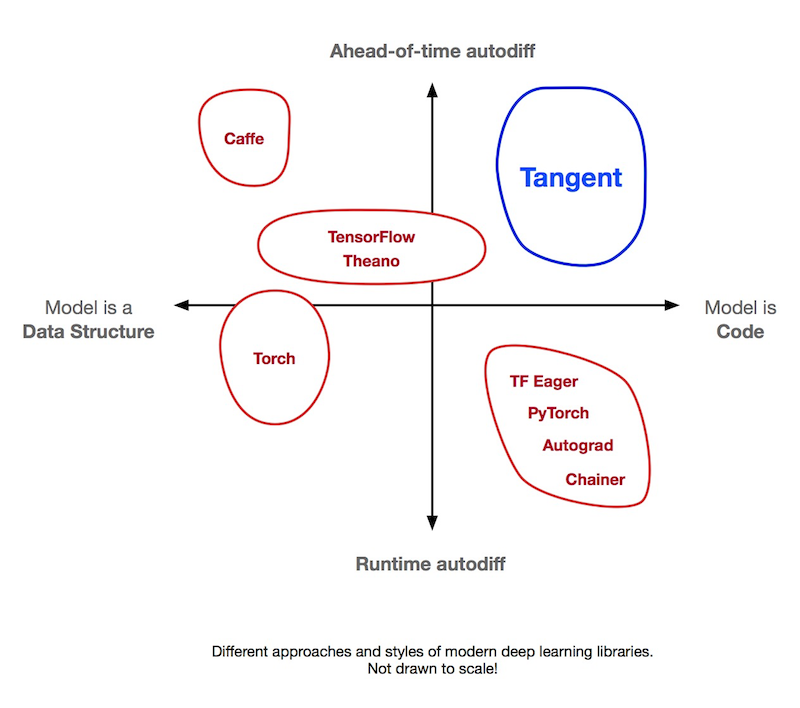
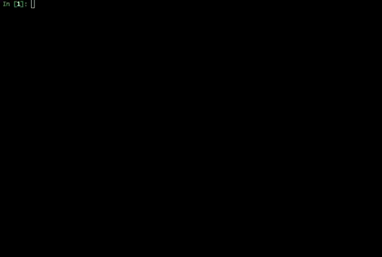
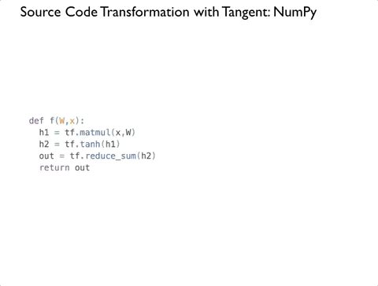
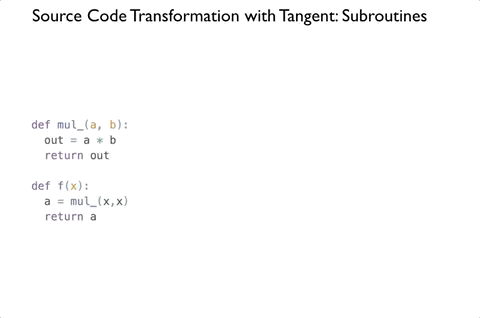
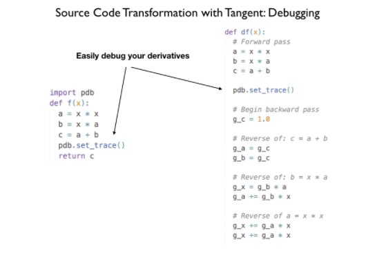
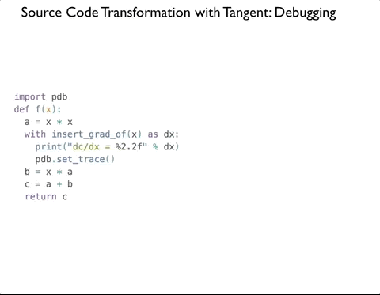
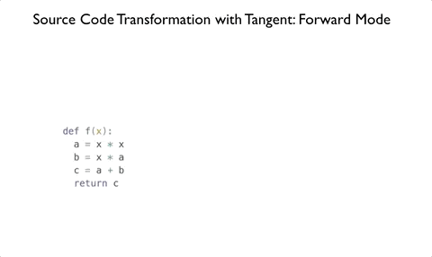
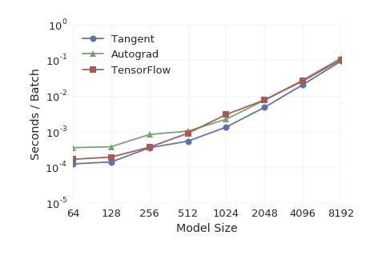

# Tangent

Tangent is a new, free, and open-source Python library for automatic differentiation.

Existing libraries implement automatic differentiation by tracing a program’s execution (at runtime, like PyTorch) or by staging out a dynamic data-flow graph and then differentiating the graph (ahead-of-time, like TensorFlow). In contrast, Tangent performs ahead-of-time autodiff on the Python source code itself, and produces Python source code as its output. Tangent fills a unique location in the space of machine learning tools.




As a result, you can finally read your automatic derivative code just like the rest of your program. Tangent is useful to researchers and students who not only want to write their models in Python, but also read and debug automatically-generated derivative code without sacrificing speed and flexibility.

Tangent works on a large and growing subset of Python, provides extra autodiff features other Python ML libraries don’t have, has reasonable performance, and is compatible with TensorFlow and NumPy.

This project is an experimental release, and is under active development. As we continue to build Tangent, and respond to feedback from the community, there might be API changes.

## Usage

Tangent has a one-function API:
```python
import tangent
df = tangent.grad(f)
```

If you want to print out derivatives at the time Tangent generates the derivative function:

```python
import tangent
df = tangent.grad(f, verbose=1)
```

Here's Tangent in action in the IPython console.



## Installing and running

### Installation

The easiest way to install Tangent is to use `pip`.

    pip install tangent

We'll have a conda package soon.

## Automatic Differentiation

Under the hood, `tangent.grad` grabs the source code of the Python function you pass it (using `inspect.getsource`, which is available in the Python standard library), converts the source code into an abstract syntax tree (AST) using `ast.parse` (also built into the Python standard library), and walks the syntax tree in reverse order.

Tangent has a library of recipes for the derivatives of basic arithmetic (`+`,`-`,`/`,`**`,`*`), pieces of syntax (`ast.For`, `ast.If`, `ast.While`) and TensorFlow Eager functions (`tf.reduce_sum`, `tf.exp`, `tf.matmul`, ... ). For each piece of syntax it encounters (for example, `c = a + b` is a single AST node `ast.Assign`), `tangent.grad` looks up the matching backward-pass recipe, and adds it to the end of the derivative function.
This reverse-order processing gives the technique its name: reverse-mode automatic differentiation.

### TF Eager

Tangent supports differentiating functions that use TensorFlow Eager functions that are composed together.

```python
def f(W,x):
  h1 = tf.matmul(x,W)
  h2 = tf.tanh(h1)
  out = tf.reduce_sum(h2)
  return out

dfdW = tangent.grad(f)
```




### Subroutines

When model code becomes long, using subroutines makes code more readable and reusable. Tangent handles taking derivatives of models that have user-defined functions.



### Control Flow

Tangent has recipes for auto-generating derivatives for code that contains if statements and loops:


You’ll notice above that we have to modify the user’s code to keep track of information that we will need in the backward pass. For instance, we need to save which branch of an if-statement was followed in the forward pass, so that we run the correct branch in the backward pass. We save this information from the forward pass by pushing it onto a stack, which we then pop off in the backward pass. This is an important data structure in ahead-of-time autodiff.

For loops require a little more bookkeeping. Tangent has to save the number of iterations of the loop on the stack. Also, loops usually overwrite the values of variables inside the loop body. In order to generate a correct derivative, Tangent has to keep track of all of the overwritten values, and restore them in the backward pass in the correct order.


## Debugging

Because Tangent auto-generates derivative code you can read, you can also easily debug your backward pass. For instance, your NN might be outputting NaNs during training, and you want to find out where the NaNs are being generated in your model. Just insert a breakpoint (e.g., pdb.set_trace()) at the end of your forward pass.



For large models, setting a breakpoint at the beginning of the backward pass and stepping through dozens of lines might be cumbersome. Instead, you might want the breakpoint to be placed later in the derivative calculation. Tangent lets you insert code directly into any location in the backward pass. First, run `from tangent import insert_grad_of`, then add a with `insert_grad_of` block containing the code you’d like to insert into the backward pass.

```python

from tangent import insert_grad_of
def f(x):
  ...
  with insert_grad_of(x) as dx:
    print("dc/dx = %2.2f" % dx)
    pdb.set_trace()
  ...
```



## Derivative Surgery

You can use the `insert_grad_of` feature to do more than debugging and logging. Some NN architectures benefit from tricks that directly manipulate the backward pass. For example, recurrent neural networks (RNNs) suffer from the "exploding gradient" problem, where gradients grow exponentially. This prevents the model from training properly. A typical solution is to force the derivatives inside of an RNN to not exceed a certain value by directly clipping them. We can implement this with `insert_grad_of`.

```python

def f(params, x):
  h = x
  for i in range(5):
  with insert_grad_of(h) as g:
    g = tf.clip_by_value(g, -1, 1)
  h = rnn(params, h)
  return h

dfdparams = tangent.grad(f)
```

You can perform other backward-pass tricks with `insert_grad_of`, such as stop gradients (use a `break` in the inlined code to stop a for loop), or synthetic gradients (replace a derivative with a prediction from a neural network). This feature lets Tangent users easily debug their models, or quickly try out derivative tweaks in the backward pass.

## Forward Mode

Reverse-mode autodiff, or backpropagation, generates efficient derivatives for the types of functions we use in machine learning, where there are usually many (perhaps millions) of input variables and only a single output (our loss). When the inverse is true, where there are many more outputs than inputs, reverse mode is not an efficient algorithm, as it has to be run as many times as there are output variables. However, a less famous algorithm, forward-mode autodiff, only has to be run as many times as there are _input_ variables.). Tangent supports forward-mode autodiff.

```python

def f(x):
  a = x * x
  b = x * a
  c = a + b
  return c

forward_df = tangent.grad(f, mode='forward')
```



## Hessian-Vector Products

Although we won’t dig into the technical details, forward-mode is very useful when combined with reverse-mode to calculate efficient higher-order derivatives, particularly for Hessian-vector products (HVP) of NNs. This is useful in research applications, and usually very painful and slow to calculate. Autograd has native forward-mode support, while TensorFlow has 3rd-party support.

To take higher-order derivatives, you can use any combination of forward- and reverse-mode autodiff in Tangent. This works because the code Tangent produces can also be fed back in as input. The autodiff literature recommends calculating HVPs in a "Forward-over-Reverse" style. This means first apply reverse mode autodiff to the function, and then apply forward mode to that.

```python

def f(x):
    a = x * x * x
    b = a * x ** 2.0
    return tf.reduce_sum(b)

hvp = tangent.grad(tangent.grad(f,mode='reverse'),mode='forward')
```

## Performance

Although we did not build Tangent for performance, it is competitive with major ML libraries. Because we are generating derivatives ahead-of-time, there is no interpretive overhead like there is with runtime autodiff libraries. We implemented a few compiler optimizations (dead code elimination, and constant folding), but we are still working on extra optimization passes to further increase performance.




## Optimization

We are often interested in the gradients of only some of the arguments. In this
case, many of the adjoint calculation might be dead code. In the optimization
pass this is removed. We also perform limited constant folding and assignment propagation.

## Known Limitations

Tangent is still an experiment, so expect some bugs. If you report them to us on GitHub, we will do our best to fix them quickly.

We are working to add support in Tangent for more aspects of the Python language (e.g., closures, inline function definitions, classes, more NumPy and TensorFlow functions). We also hope to add more advanced automatic differentiation and compiler functionality in the future, such as automatic trade-off between memory and compute (Griewank and Walther 2000; Gruslys et al., 2016), more aggressive optimizations, and lambda lifting.

Many of Python's advanced features are difficult to statically analyze or to
define sensible gradients of, so we restrict Python to a functional subset
(i.e. no mutable objects).

### Closures

Closures are currently not supported for the following reasons:

* AD relies on being able to resolve function names. If function names are
  resolved using the enclosing function namespace, we cannot be sure that they
  will resolve to the same function at each call.
* Although we can access functions from the enclosing function namespace, we
  cannot write to this namespace, which is required for the gradients.

### Classes

Classes are not _currently_ supported, but are on our near-term roadmap.
This will enable PyTorch/Chainer/TFEager-style class definitions of neural networks, and parameterized functions, like in TF Slim.

## Team

Tangent is developed by Alex Wiltschko, Bart van Merriënboer and Dan Moldovan.
